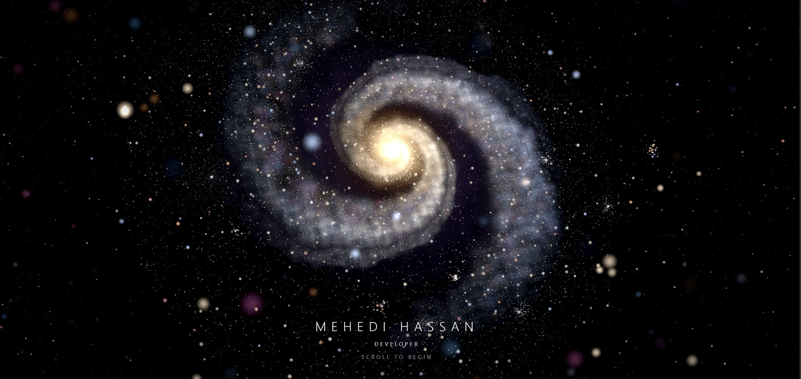
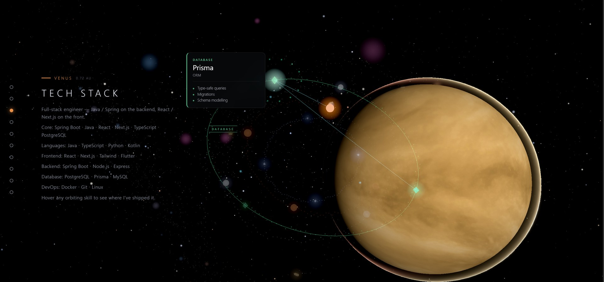
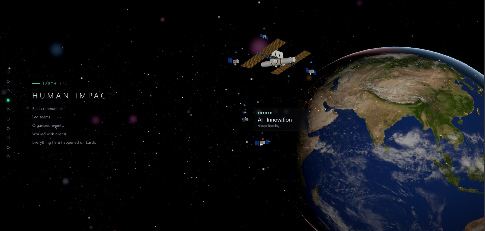
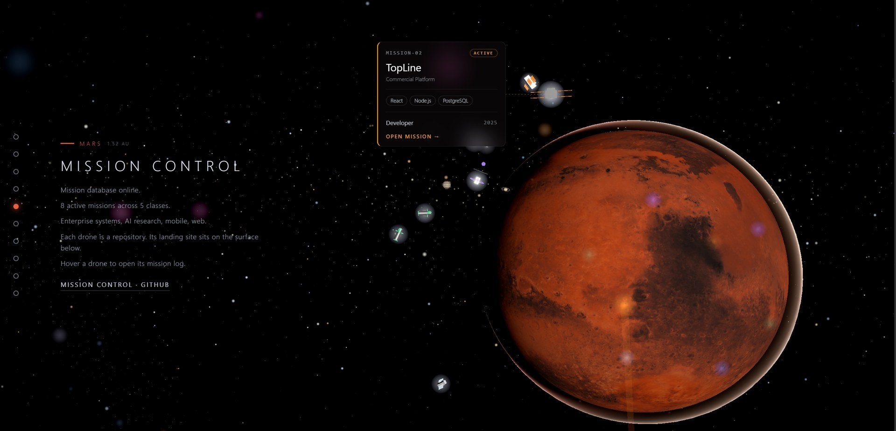
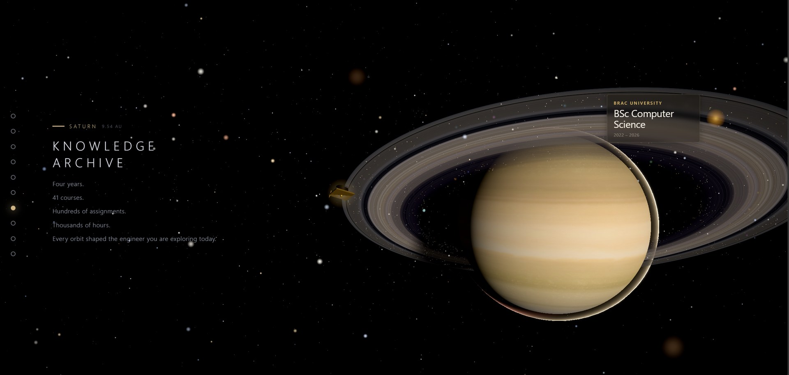
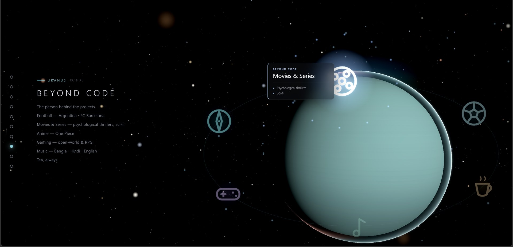
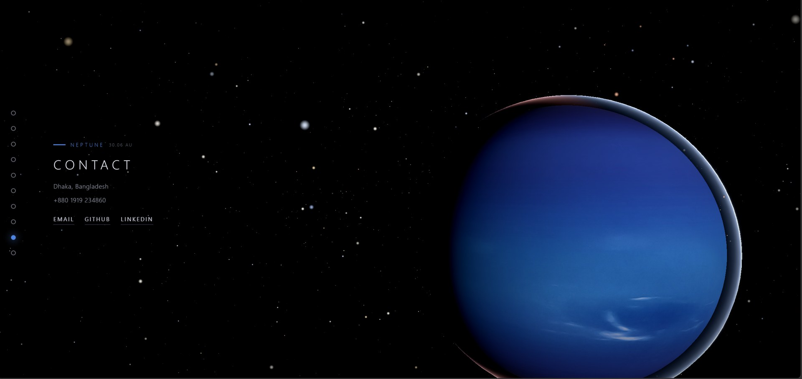

<div align="center">

# 🌌 Mehedi Cosmos

### A portfolio you fly through — not a page you scroll.

An immersive 3D universe built in the browser. You enter through a black hole, drift into a spiral galaxy, then dive into a solar system where **every planet is a chapter of my story**.

[**⚡ Launch the universe →**](https://mehedi-cosmos.vercel.app)

<br/>



<br/>

`Next.js 15` · `React 19` · `Three.js` · `React Three Fiber 9` · `GSAP` · `Zustand` · `GLSL`

</div>

---

## The journey

You don't click through tabs. You **travel**. Scroll is the throttle — the camera flies from world to world, and each one holds a different part of who I am.

### ☀️ Venus — Tech Stack



Every skill I ship with is a satellite in orbit. Hover one and it tells you where I've actually used it — the stack, live and in motion.

### 🌍 Earth — Human Impact



The one place everything actually happened. Communities built, teams led, clients shipped — orbited by the ISS and a constellation of the people-side of the work.

### 🔴 Mars — Mission Control



Every project is a drone that landed on the surface, and every drone is a repository. Hover one to open its mission log — stack, role, year, and a link straight into the code.

### 🪐 Saturn — Knowledge Archive



Four years, 41 courses, thousands of hours. The education that shaped the engineer — archived in the rings.

### 🌑 Uranus — Beyond Code



The person behind the projects. Football, anime, films, music — the orbit of things that aren't on a résumé but are very much the point.

### 🔵 Neptune — Contact



The edge of the system. Dhaka, Bangladesh — and every way to reach me.

---

## What makes it move

- **⚫ Black-hole entry gate** — the preloader is a live 2D-canvas black hole spinning 2,400 stars. Press `ENTER` and the field dives *through* it — a real warp, used to mask the WebGL universe compiling behind a still, dark cover so the galaxy emerges already-rendered with no jank.
- **🌀 One persistent canvas** — the site is a *single* WebGL scene that never reloads. Nothing teleports; the camera physically travels between every chapter.
- **✨ Procedural galaxy** — 24k+ stars generated on the fly, plus lensed nebulae and deep-space haze.
- **🛰️ Interactive orbits** — skills, projects and interests orbit their planets as hoverable nodes with live detail cards.
- **🎬 Cinematic post-processing** — ACES tone mapping, bloom, and adaptive quality that tunes pixel ratio and effects to the device in real time.
- **📱 Mobile gate** — phones are met by a cinematic off-screen black hole and a friendly "come back on a bigger screen" — the heavy WebGL never loads where it can't shine.
- **♿ Reduced-motion aware** — respects `prefers-reduced-motion` and falls back to still frames.

---

## Tech stack

| Layer | Tools |
|---|---|
| **Framework** | Next.js 15 (App Router, static export) · React 19 |
| **3D / WebGL** | Three.js 0.178 · React Three Fiber 9 · Drei · postprocessing |
| **Animation** | GSAP · custom GLSL shaders |
| **State** | Zustand |
| **Content** | Zod-validated schema (CI-checked) |
| **Language** | TypeScript (strict) |
| **Deploy** | Vercel |

---

## Run it locally

```bash
npm install
npm run dev              # universe at localhost:3000

npm run typecheck        # strict TS, no emit
npm run content:validate # Zod-validate world content (runs in CI)
npm run build            # production build
```

> Best experienced on a desktop or laptop with a discrete GPU. It's WebGL-heavy by design.

---

## Design principles

- **Exploration over navigation** — you discover, you don't click a menu.
- **Story over résumé** — a journey, not a list of bullet points.
- **Physics over decoration** — gravity, orbits and lensing do the work.
- **Nothing teleports** — one continuous universe, always.

<div align="center">

<br/>

**Built by [Mehedi Hassan](https://mehedi-cosmos.vercel.app)** · BSc Computer Science, BRAC University

*Go full-screen. Turn the sound up. Scroll slowly.*

</div>
